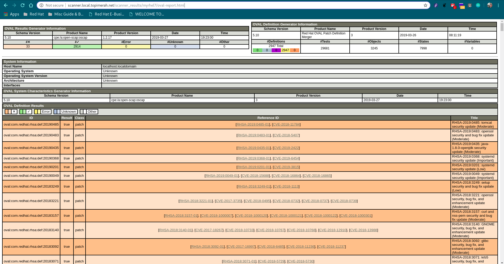

= Container Image openSCAP Scanner (Non-OpenShift Hosted)

*Pre-requisites*:

- Logged in to registry and ~/.docker/config.json or ~/.dockercfg exists.
- For pyscanner.py: Access to Red Hat registry to pull openSCAP image.
- For pyscanner_cli.py: Access to Red Hat CVE OVAL definition(http://www.redhat.com/security/data/oval/com.redhat.rhsa-all.xml).
- running Docker daemon.

*This scanner use-case:*

1. Running on bare-metal or VM.
2. Options to choose between:
a.  Containerized openSCAP (`pyscanner.py`)
b. RPM based openSCAP (`pyscanner_cli.py`)

*pyscanner.py(Containerized openSCAP)*
[source, bash]

pyscanner.py --image-url docker-registry-default.apps.example.com/parks-dev/mlbparks --image-tag 0.0.0 --image-mount /mnt/imagetest --scan-name myrhel7

[source, bash]
----
usage: pyscanner.py [-h] --image-url IMAGE_URL --image-tag IMAGE_TAG --image-mount
               IMAGE_MOUNT --scan-name SCAN_NAME

A wrapper to mount overlay image layer and scan. Store result in directory for processing.

optional arguments:
  -h, --help            show this help message and exit
  --image-url IMAGE_URL
                        The location of the image in upstream repo
  --image-tag IMAGE_TAG
                        The tag for the image
  --image-mount IMAGE_MOUNT
                        The location of the overlay image mount point.
  --scan-name SCAN_NAME
                        This scan runtime name.

%s
Sample usage: --image-url=docker-registry-default.example.com/repo/myimage --image-tag=2.3.5 --image-mount=/mnt/scaprun-repo-myimage-2.3.5 --result-dir=/openscap/results --scan-name=repo-myimage-latest-1
----

*pyscanner_cli.py(CLI openSCAP)*

Example with webserver hosting the results. ( Setting up webserver it out from this README scope.)

[source, bash]
----
[root@scanner ~]# ./pyscanner_cli.py --image-url docker-registry-default.example.com/rhel7/rhel --image-tag 7.5 --image-mount=/mnt/scaprun-rhel7-rhel-0.0.0 --result-dir=/var/www/html/scanner_results --scan-name=myrhel7
----

